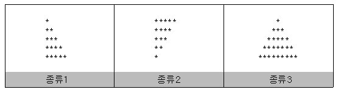

# 08.22.토요일

## JUNGOL 1523: 별삼각형1

> Q: 삼각형 높이 n과 종류 m을 입력받고 다음 그림과 같이 출력하시오.




> cause of failuer: 지난번에 했던 문제와 거의 유사한 문제로 저번에는 m = 3: for문 안에 1개의 for문만 넣고 새로운 변수에 `+=`과 같은 연산을 했다. 그러나 이번에는 for문안에 병렬로 구성된 2개의 for문을 넣어 새로운 변수와 연산을 쓰지않고 더 간단히 계산했다.


```python
n, m = map(int, input().split())

if n < 0 or n > 100 or m > 3 or m < 1:
    print("INPUT ERROR!")

elif m == 1:
    for i in range(n):
        for j in range(i+1):
            print("*", end = '')
        print()

elif m == 2:
    for i in range(n):
        for j in range(i, n):
            print("*", end='')
        print()

elif m == 3:
    for i in range(n):
        # 여기서 for문안에 병렬식으로 2개의 for문을 넣어 문제 풀이법을 단순화했다.
        for j in range(n-1-i):
            print(" ", end = '')
        for k in range(i*2 + 1):
            print("*", end = '')
        print()
```

> solution: 문제 풀이법에 대해 알고 있던 상황에서 머리로만 다시 생각해보니 힘들었다. 그래서 더 간단한 방법을 찾던 중 1개는 증가, 1개는 감소이기 때문에 일반 for문을 2개 만들어 각각 증가와 감소를 해주었다.