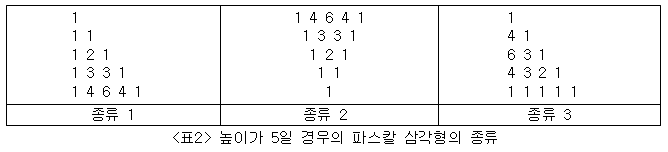

## 08.23.일요일.

### 문제번호 JUNGOL 2071:파스칼 삼각형

> Q.  그림과 같이 출력하시오. 삼각형 높이:n, 종류:m




> cause of failuer: 각 경우마다 새로운 배열을 만들려고 했었다.
>
> 종류1을 기준으로 종류2는 수학적좌표로는 x축 대칭, 행렬에서는 행 대칭이다.
>
> 종류3의 경우 수학적 좌표로 y=x 대칭이고, 행렬의 경우 y=-x대칭이다.

--------

> solution: 사실 아직 제대로 m = 2, 3일때 왜 저렇게 해야하는지 모른다....

```python
n, m = map(int, input().split())
arr = list([0] * n for _ in range(n))

for i in range(n):
    for j in range(i+1):
        # 0열은 모두 1이다
        if j == 0:
            arr[i][j] = 1
        # i와 j가 같은 대각선은 모두 1이다
        if i == j:
            arr[i][j] = 1
        if i > 1:
            arr[i][j] = arr[i-1][j-1] + arr[i-1][j]

for i in range(n):
    for j in range(n):
        if arr[i][j] == 0:
            arr[i][j] = ' '

if m == 1:
    for i in range(n):
        for j in range(n):
            print(arr[i][j], end = ' ')
        print()

if m == 2:
    # 행 대칭, x축 대칭
    for i in range(n-1, -1, -1):
        for j in range(n):
            print(arr[i][j], end = ' ')
        print()
        print(' ' * (n-i), end ='')

if m == 3:
    for i in range(n-1, -1, -1):
        for j in range(n-1, -1, -1):
            print(arr[j][i], end = ' ')
        print()
```

-----

### ex

```python
for i in range(n):
	for j in range(n):
		print(arr[i][j], end = ' ')
	print()

1
1 1
1 2 1
1 3 3 1
1 4 6 4 1
```

```python
# print에서 i와 j 바꿨을 때: 수학적 좌표로 y = -x 대칭, 행렬 바꿈
for i in range(n):
	for j in range(n):
		print(arr[j][i], end = ' ')
	print()
    
1 1 1 1 1
  1 2 3 4
    1 3 6
      1 4
        1
```

```python
# i(행) 역순일 때: 수학적 좌표로 x축 대칭, 행 변환
for i in range(n-1, -1, -1):
	for j in range(n):
		print(arr[i][j], end = ' ')
	print()
    
1 4 6 4 1
1 3 3 1
1 2 1
1 1
1
```

```python
# j(열) 역순일 때: 수학적 좌표로 y축 대칭, 열 변환
for i in range(n):
	for j in range(n-1, -1, -1):
		print(arr[i][j], end = ' ')
	print()
    
        1
      1 1
    1 2 1
  1 3 3 1
1 4 6 4 1
```

```python
# i(행), j(열) 역순일 때: 행 변환하고 열 변환
for i in range(n-1, -1, -1):
	for j in range(n-1, -1, -1):
		print(arr[i][j], end = ' ')
	print()
    
1 4 6 4 1
  1 3 3 1
    1 2 1
      1 1
        1
```


